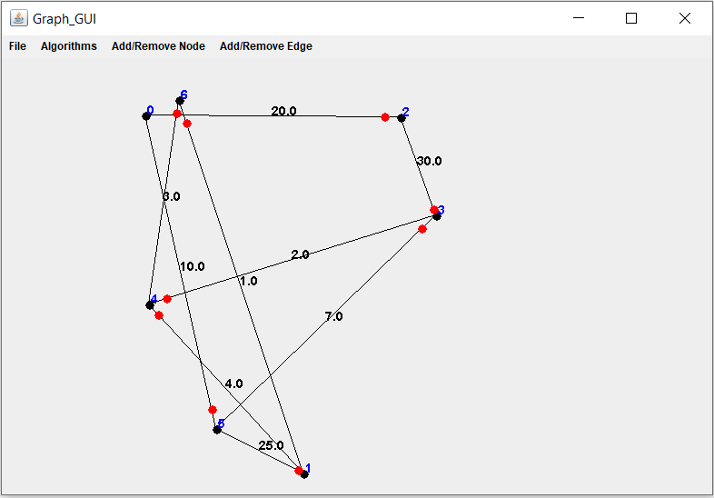

# Ex2
In this project we represnt an implementation of directed weighted graph , graphic interface (GUI) of the graph and mathemtical graph algorithms.

## Class Node
This class represent a node (vertex) in a (directional) weighted graph and operations applicable on it based on node_data interface.
Node attributes:
- key;
- location;
- info;
- tag;
- weight;

## Class Edge
This class represent a directional edge(src,dest) in a (directional) weighted graph and operations applicable on it based on edge_data interface.
Edge attributes:
- src;
- dst;
- tag;
- weight;
- info;

## Class DGraph
This class represent a a directional weighted graph that support a large number of nodes (over 100,000) operations applicable on it based on graph interface.
Graph attributes:
- nodes
- edges

## Class Graph_Algo
This class represent the "regular" Graph Theory algorithms including:
- clone();
- init(String file_name);
- save(String file_name);
- isConnected();
- double shortestPathDist(int src, int dest);
- List<Node> shortestPath(int src, int dest); 
- List<node_data> TSP(List<Integer> targets);

Algorithm implementation is based on Dijkstra's algorithm:
[https://en.wikipedia.org/wiki/Dijkstra%27s_algorithm](https://en.wikipedia.org/wiki/Dijkstra%27s_algorithm)

## Class Graph_GUI
This class represent a graphic interface of a graph. For drawing functions on graph we used JFRAM based on swing and awt Libraries. 
Operations that are applicable on it including:

### File
- save
- load
		
### Algorithms
- isConnected
- shortestPathDist
- shortestPath
- TSP	
		
### Add/Remove Node
- addNode
- removeNode
		
### Add/Remove Edge
- connect\addEdge
- removeEdge
		
## Relevant files for testing 
- test.txt

## External libraries
1. junit-jupiter-api-5.4.0
2. junit-platform-commons-1.4.0

More details can be found on Wiki

	
	